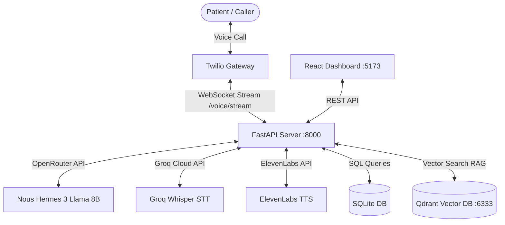

# 🦷 Dental Clinic Voice Assistant (Alex)

Welcome to the **Dental Clinic Voice Assistant** project. This is a decoupled, RAG-enabled AI receptionist ("Alex") powered by the **Hermes Agent framework**. The assistant helps dental clinics manage incoming telephony calls, handle patient bookings, query clinic logistics (pricing, hours, rules), and visualize call metrics on a sleek React dashboard.

---

## 🗺️ System Architecture



---

## 📂 Project Directory Structure

*   [**`client/`**](file:///c:/Users/Anujan/Desktop/Dental_clinic_assistant/client): A React + Vite web dashboard displaying real-time call volumes, sentiment charts, active call transcripts, and an interactive appointments calendar.
*   [**`server/`**](file:///c:/Users/Anujan/Desktop/Dental_clinic_assistant/server): A FastAPI server managing inbound Twilio WebSockets audio streams, orchestrating the `HermesAgent` core cognitive loop, integrating Speech services, and exposing API endpoints for the dashboard.
*   [**`db_server/`**](file:///c:/Users/Anujan/Desktop/Dental_clinic_assistant/db_server): Database management module holding the SQLite schema initialization (`schema.sql`) and Qdrant ingestion scripts (`qdrant_manager.py`) to chunk and index [**`MEMORY.md`**](file:///c:/Users/Anujan/Desktop/Dental_clinic_assistant/db_server/MEMORY.md).
*   [**`tests/`**](file:///c:/Users/Anujan/Desktop/Dental_clinic_assistant/tests): Automated test suites for validating vector chunking, metadata extraction, and RAG search queries.

---

## 🛠️ Prerequisites

Before starting, ensure you have:
*   [Docker](https://www.docker.com/) and Docker Compose installed.
*   *Alternatively, if running locally:* Python 3.11+, Node.js 18+, and WSL (Windows Subsystem for Linux) with `uv` package manager installed.
*   API keys for:
    *   **OpenRouter** (for the `nousresearch/hermes-3-llama-3.1-8b` model)
    *   **Groq Cloud** (for Whisper STT)
    *   **ElevenLabs** (for Neural TTS)
    *   **Twilio** (optional, for configuring voice lines)

---

## ⚙️ Environment Variables Configuration

Copy the `.env.example` templates in the respective directories to a new `.env` file:

1.  **Backend Config**: Copy [**`server/.env.example`**](file:///c:/Users/Anujan/Desktop/Dental_clinic_assistant/server/.env.example) to `server/.env` and update the keys:
    *   `OPENROUTER_API_KEY`
    *   `GROQ_API_KEY`
    *   `ELEVENLABS_API_KEY`
    *   `ELEVENLABS_VOICE_ID` (Optional, defaults to Rachel)
    *   `TWILIO_ACCOUNT_SID` / `TWILIO_AUTH_TOKEN` (Optional)
2.  **Database Config**: Copy [**`db_server/.env.example`**](file:///c:/Users/Anujan/Desktop/Dental_clinic_assistant/db_server/.env.example) to `db_server/.env`.
3.  **Frontend Config**: Copy [**`client/.env.example`**](file:///c:/Users/Anujan/Desktop/Dental_clinic_assistant/client/.env.example) to `client/.env`.

---

## 🚀 Running the Application

### Option A: Using Docker Compose (Unified Stack)

The fastest way to spin up the entire ecosystem (Qdrant, Initializer, FastAPI backend, and React frontend) is via Docker Compose.

1.  Start the Qdrant database and initialization server:
    ```bash
    cd db_server
    docker-compose up -d
    ```
2.  Start the backend gateway server:
    ```bash
    cd ../server
    docker-compose up -d
    ```
3.  Start the React dashboard frontend:
    ```bash
    cd ../client
    docker-compose up -d
    ```

Once all containers are running, navigate to:
*   **Frontend Dashboard**: `http://localhost:5173`
*   **FastAPI API Docs**: `http://localhost:8000/docs`

---

### Option B: Local Development Setup (WSL & Native)

If you are developing locally or debugging with your editor/IDE:

#### 1. Setup the Database and Qdrant
Ensure a local instance of Qdrant is running on port `6333` (e.g. via `docker run -d -p 6333:6333 -p 6334:6334 qdrant/qdrant`).
Then initialize the SQLite database and ingest the knowledge base:
```bash
cd db_server
wsl uv pip install -r requirements.txt
python db_manager.py
python -c "import qdrant_manager; qdrant_manager.ingest_knowledge_document('MEMORY.md')"
```

#### 3. Start the Backend Server
```bash
cd ../server
wsl uv pip install -r requirements.txt
uvicorn main:app --host 0.0.0.0 --port 8000 --reload
```

#### 4. Start the React Frontend Dashboard
```bash
cd ../client
npm install
npm run dev
```

---

## 🧪 Running Automated Tests

To verify that the RAG indexing, chunking, and search logic works correctly, run the unittest suite from the root directory using your virtual environment interpreter:

*   **Under WSL/Linux**:
    ```bash
    wsl .venv/bin/python -m unittest tests/test_rag.py
    ```
*   **Under Windows Host**:
    ```powershell
    .venv-win\Scripts\python -m unittest tests/test_rag.py
    ```

---

## 🌐 Free Deployment (Interview-Ready)

Recommended setup:
1. Backend on Render (free web service)
2. Frontend on Vercel (free static hosting)
3. Qdrant on your existing cloud cluster

### 1) Deploy Backend (Render)

Create a new **Web Service** from this repository.

Use these settings:
1. Runtime: Docker
2. Dockerfile path: `server/Dockerfile`
3. Health check path: `/health`
4. Port: `8000`

Set these environment variables in Render:
1. `OPENROUTER_API_KEY` = your key
2. `OPENROUTER_MODEL` = `nousresearch/hermes-3-llama-3.1-8b`
3. `OPENROUTER_BASE_URL` = `https://openrouter.ai/api/v1`
4. `QDRANT_HOST` = your Qdrant cloud URL
5. `QDRANT_PORT` = `443`
6. `QDRANT_API_KEY` = your Qdrant API key
7. `SQLITE_DB_PATH` = `/tmp/dental_clinic.sqlite`
8. `ALLOWED_ORIGINS` = your Vercel frontend URL (add localhost only if needed)

Optional voice env vars:
1. `GROQ_API_KEY`
2. `ELEVENLABS_API_KEY`
3. Twilio variables

After deploy, verify:
1. `https://<your-backend>.onrender.com/health`
2. `https://<your-backend>.onrender.com/docs`

### 2) Deploy Frontend (Vercel)

Create a new Vercel project from this repository and set:
1. Root directory: `client`
2. Framework preset: Vite
3. Build command: `npm run build`
4. Output directory: `dist`

Set environment variable:
1. `VITE_API_URL` = your Render backend URL (for example `https://<your-backend>.onrender.com`)

`client/vercel.json` is included so SPA routes are handled correctly.

### 3) What to share with interviewers

Share these links:
1. Frontend URL (Vercel)
2. Backend health URL: `https://<backend>/health`
3. Backend docs URL: `https://<backend>/docs`

Suggested verification flow for reviewers:
1. Open frontend and use Live Agent Simulator (`/api/chat`)
2. Create manual appointments and check they appear in ledger
3. Open backend docs and run `/api/metrics` and `/api/appointments`

Note: free tiers can sleep after inactivity, so first request may take longer.

